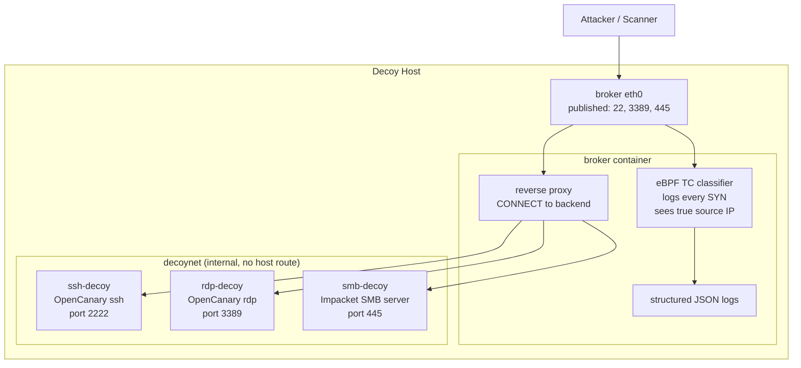

# cyber-decoy

A containerized network decoy (honeypot) that advertises **SSH**, **RDP**, and
**SMB**, observes every inbound connection with **eBPF**, and reverse-proxies
each session into an isolated decoy container.

The design separates two concerns:

1. **Observation.** An eBPF TC classifier attached to the broker's interface
   records every inbound TCP SYN, including scans against ports the decoy does
   not serve. This gives full visibility into probing activity.
2. **Interaction.** A userspace reverse proxy in the broker accepts connections
   on the advertised ports and opens a matching connection to the decoy
   container for that service, piping bytes in both directions and logging the
   full session.

> This is a defensive tool for detecting and studying unauthorized activity on
> networks you own or are authorized to monitor. Deploy it only where you have
> that authority.

## Architecture



Four containers in total:

| Container   | Role                                                        | Network        |
|-------------|-------------------------------------------------------------|----------------|
| `broker`    | Public front door: eBPF observation plus reverse proxy      | edge + decoynet |
| `ssh-decoy` | OpenCanary `ssh` module (real handshake, captures creds)     | decoynet only  |
| `rdp-decoy` | OpenCanary `rdp` module (NLA mimic, captures usernames)     | decoynet only  |
| `smb-decoy` | Impacket SimpleSMBServer (real SMB2/3, captures auth)       | decoynet only  |

The decoys live on an `internal` Docker network (`decoynet`) with no route to
the host or the outside world. Only the broker can reach them. Nothing an
attacker does inside a decoy can reach the host network directly.

## How the eBPF routing works

The broker publishes ports 22, 3389, and 445 to the host, so inbound packets
arrive on the broker's `eth0`. Two things then happen to each packet:

- The **eBPF TC ingress program** (`broker/bpf/decoy.bpf.c`) parses the
  Ethernet, IP, and TCP headers, and for each new connection attempt (SYN set,
  ACK clear) writes a `conn_event` to a ring buffer: source IP and port,
  destination port, TCP flags, and whether the port is an advertised service.
  The packet is passed through unchanged (`TC_ACT_OK`).
- The **userspace proxy** accepts the connection on the matching listener and
  performs the equivalent of a `CONNECT` to the decoy backend for that service,
  then relays bytes both ways.

The `advertised_ports` eBPF map is populated at startup from `config.yaml`, so
the classifier can tag whether a probe hit a served port or an unsolicited one.
This makes horizontal port scans visible even though only three ports are
proxied.

If you want to advertise "everything is open" and funnel arbitrary destination
ports into the broker, extend the classifier to rewrite the destination port or
use a TPROXY / `bpf_sk_assign` redirect. The current version keeps the packet
path untouched and limits itself to observation, which is the safer default.

## Repository layout

```
cyber-decoy/
├── README.md
├── docker-compose.yml         # 4-container stack
├── docker-compose.override.yml # local macOS dev: no eBPF caps, port 22 remap
├── Makefile                   # build / up / down / bpf helpers
├── LICENSE
├── scripts/
│   └── setup.sh               # host preflight checks
├── broker/
│   ├── Dockerfile             # compiles eBPF object + Go binary
│   ├── config.yaml            # advertised services (configurable)
│   ├── go.mod
│   ├── main.go                # entrypoint
│   ├── bpf/
│   │   └── decoy.bpf.c        # eBPF TC classifier
│   └── internal/
│       ├── config/config.go   # config loader
│       ├── proxy/proxy.go     # TCP reverse proxy
│       └── bpf/loader.go      # loads + attaches eBPF, streams events
└── decoys/                     # all three run OpenCanary
    ├── ssh/
    │   ├── Dockerfile
    │   └── opencanary.conf     # ssh module, port 2222
    ├── rdp/
    │   ├── Dockerfile
    │   └── opencanary.conf     # rdp module, port 3389
    └── smb/
        ├── Dockerfile          # single Python process, non-root
        ├── smb_decoy.py        # Impacket SimpleSMBServer + JSON logging
        └── requirements.txt    # impacket (pinned)
```

## Requirements

- Linux host with **kernel 6.6 or newer** for the TCX eBPF attach path. On older
  kernels the proxy still runs; only eBPF observation is skipped (the broker logs
  a warning and continues).
- Docker Engine with the Compose plugin (**v2.24+** if you use the bundled
  `docker-compose.override.yml`, which relies on the `!reset` / `!override` tags).
- A mounted BPF filesystem: `sudo mount -t bpf bpf /sys/fs/bpf`.

### Architecture

The broker image detects its build architecture and passes the matching
`__TARGET_ARCH_*` macro to clang, so it builds on both `x86_64` and `aarch64`
(Apple Silicon, Graviton). Note that `gcc-multilib` is deliberately **not**
installed: it is an x86-only package with no arm64 candidate, and including it
breaks the build on arm64 with apt exit code 100. Only `clang` and `libbpf-dev`
are needed to compile the eBPF object.

### Developing on macOS

Docker Desktop on macOS runs containers inside a LinuxKit VM rather than on your
host kernel, so TC/TCX eBPF attach generally will **not** work there. This is not
fatal: eBPF is best effort by design, so the broker logs `ebpf disabled: attach
failed` and the reverse proxy plus all three decoys run and log normally. You can
develop and test the entire proxy path locally, then get real eBPF observation
when you deploy to a Linux host.

`docker-compose.override.yml` is loaded automatically and makes this pleasant: it
drops the eBPF capabilities (useless in the VM) and remaps host port 22 to 2022,
since the Mac's own sshd owns 22.

```bash
docker compose up --build                    # local dev, override applied
docker compose -f docker-compose.yml up -d   # real deployment, override bypassed
```

Run the preflight check first:

```bash
./scripts/setup.sh
```

## Quick start

```bash
# 1. Build all four images (compiles the eBPF object inside the broker image)
make build

# 2. Start the stack
make up

# 3. Watch what happens
make logs
```

Then probe it from another machine (or localhost for a smoke test):

```bash
ssh -p 22 user@DECOY_HOST          # hits the SSH decoy
nc DECOY_HOST 3389                 # hits the RDP decoy
nc DECOY_HOST 445                  # hits the SMB decoy
nc DECOY_HOST 8080                 # unadvertised: observed by eBPF, no proxy
```

The broker emits JSON for eBPF probe events and proxied sessions; each decoy
emits OpenCanary JSON events. To watch credentials land:

```bash
docker compose logs -f ssh-decoy | grep 4002
```

Unlike a banner-only stub, `ssh -p 22 user@DECOY_HOST` now completes a real key
exchange and prompts for a password. Every attempt is captured. Verify the
service fingerprint holds up under version detection:

```bash
nmap -sV -p 22,3389,445 DECOY_HOST
```

Tear down with:

```bash
make down
```

## Configuration

Services are defined in `broker/config.yaml`. Each entry is independently
toggleable and remappable:

```yaml
services:
  - name: ssh
    enabled: true
    listen_port: 22
    backend: ssh-decoy:2222
```

To add a service, add an entry here, publish the port in `docker-compose.yml`,
and add a decoy container. To disable one, set `enabled: false` (and optionally
drop its published port).

Note that host port 22 is usually taken by the host's real SSH daemon. For a lab
you can remap the published side in `docker-compose.yml`, for example
`"2022:22"`, and point your scanner there.

## The decoy backends

All three decoys run [OpenCanary](https://github.com/thinkst/opencanary)
(Thinkst), configured so each container enables exactly one module. Logs are
emitted as JSON on stdout, so `docker compose logs` and any SIEM shipper work
without extra plumbing.

| Container   | OpenCanary module | Listens | What it actually does |
|-------------|-------------------|---------|-----------------------|
| `ssh-decoy` | `ssh`             | 2222    | Real SSH key exchange via twisted.conch. Captures every username/password pair. |
| `rdp-decoy` | `rdp`             | 3389    | Mimics an NLA-enabled server, always returns login failure, extracts the `mstshash` username. |
| `smb-decoy` | Impacket         | 445     | Pure-Python SMB2/3 server. Presents bait shares and logs connections and NTLM auth attempts as JSON. |

### Event types

OpenCanary tags each event with a numeric `logtype`. The ones you will see here:

| logtype | Constant in `opencanary/logger.py` | Meaning |
|---------|------------------------------------|---------|
| 1000    | `LOG_BASE_BOOT`            | Daemon startup |
| 4000    | `LOG_SSH_NEW_CONNECTION`   | SSH connection opened |
| 4001    | `LOG_SSH_REMOTE_VERSION_SENT` | Client sent its version string |
| 4002    | `LOG_SSH_LOGIN_ATTEMPT`    | SSH login attempt (includes USERNAME and PASSWORD) |
| 5000    | `LOG_SMB_FILE_OPEN`        | SMB file opened (includes USER, SHARENAME, FILENAME) |
| 14001   | `LOG_RDP`                  | RDP connection / login attempt |

A captured SSH credential looks like this:

```json
{"dst_port": 2222, "logtype": 4002, "node_id": "decoy-ssh",
 "src_host": "10.0.0.66", "src_port": 42958,
 "logdata": {"USERNAME": "admin", "PASSWORD": "Passw0rd123"}}
```

### Important: the decoys cannot see the attacker's IP

This is a direct consequence of the broker architecture, and it is the single
most important thing to understand about reading these logs.

The broker terminates the attacker's TCP connection and opens a **new** one to
the decoy. So from OpenCanary's point of view, the client is the broker. Every
`src_host` in a decoy event will be the broker's address on `decoynet`,
not the real source.

The true source IP is still captured, just in a different place:

| Layer | Knows the real source IP? | Knows what was attempted? |
|-------|---------------------------|---------------------------|
| eBPF classifier (`probe observed`) | Yes | No, SYN metadata only |
| Broker proxy (`session opened`)    | Yes | No, byte counts only |
| OpenCanary decoy (`logtype 4002`)  | **No** | Yes, credentials/files |

So attribution requires correlating broker logs with decoy logs, joining on
timestamp and service. The broker logs `remote` (the true attacker address) and
`backend` for every session, which is what makes the join possible:

```bash
docker compose logs broker    | grep 'session opened'   # who
docker compose logs ssh-decoy | grep '"logtype": 4002'  # what they tried
```

If you need the real IP inside the decoy itself, the options are to send PROXY
protocol (the decoys do not parse it, so this would mean patching them), or to
replace the userspace proxy with a transparent redirect (TPROXY or eBPF
`bpf_sk_assign`) that preserves the original source address. Both are listed
under Roadmap. Until then, treat the broker as the source of truth for "who" and
the decoy as the source of truth for "what".

### The SMB decoy (Impacket, not Samba)

Unlike SSH and RDP, this decoy does not use OpenCanary. OpenCanary's smb module
is only a log watcher: it tails a file and parses `smbd_audit` lines emitted by
a real Samba server, which meant running Samba plus rsyslog plus opencanaryd
under supervisord, a five-link chain where any link could fail silently.

`smb-decoy` replaces all of that with a single Python process built on
[Impacket](https://github.com/fortra/impacket)'s `SimpleSMBServer`, a pure-Python
implementation of SMB1/2/3. It binds 445, presents read-only bait shares, answers
SMB2/3 negotiation (so `nmap -sV` sees a real service), and logs connections and
NTLM authentication attempts as one JSON object per line on stdout. The captured
username, domain, and workstation from an attacker's authenticate message are the
credential-capture payoff.

Security note: Impacket's smbserver carried a critical path traversal,
[CVE-2021-31800](https://checkmarx.com/blog/cve-2021-31800-how-we-used-impacket-to-hack-itself/),
that specifically affected honeypots. It was fixed in 0.9.23. `requirements.txt`
pins a current release and must not be downgraded below that. The container also
runs non-root, read-only, with all capabilities dropped except NET_BIND_SERVICE.

### Configuring the decoys

Each decoy owns an `opencanary.conf` (installed to `/etc/opencanaryd/`). Useful
knobs:

- **SSH banner**: `ssh.version` in `decoys/ssh/opencanary.conf`. It currently
  claims `SSH-2.0-OpenSSH_8.9p1 Ubuntu-3ubuntu0.1`. Make it match the OS you are
  pretending to be; a Ubuntu banner on a box claiming to be Windows is a tell.
- **SMB share names**: the `addShare(...)` calls in `decoys/smb/smb_decoy.py`,
  plus the bait files created in `decoys/smb/Dockerfile`. The share names and
  filenames are the lure.
- **Ports**: keep these aligned with `backend` in `broker/config.yaml`.

To enable another OpenCanary module (ftp, telnet, mysql, vnc, redis, and others
are available), set `<module>.enabled` and `<module>.port`, add a decoy container,
and add a matching service to `broker/config.yaml`.

### SSH host key persistence

`ssh-decoy` mounts a named volume at `/var/lib/opencanary` (`ssh.key_path`), so
the generated host key survives restarts. Without it OpenCanary generates a fresh
key on every start and the changing fingerprint is an obvious tell.

## Troubleshooting the SMB decoy

The SMB decoy is now a single process, so troubleshooting is straightforward.

```bash
docker compose logs -f smb-decoy
```

Every line is JSON. You should see one `smb_decoy_start` at boot, then
`smb_connect`, `smb_auth_attempt`, and `smb_tree_connect` events as clients
interact. Test it from the host with any SMB client:

```bash
# macOS Finder: Go > Connect to Server
open 'smb://guest@localhost/HR-Payroll'
# or from Linux
smbclient -L //localhost -p 445 -N
```

Common issues:

- No `smb_decoy_start` line and the container exits: check `requirements.txt`
  installed cleanly. Impacket needs Python 3.8+; the image uses 3.12.
- Connects but no `smb_auth_attempt`: some clients enumerate shares anonymously
  without ever authenticating. That still produces `smb_connect` and
  `smb_tree_connect`. Force auth by mapping a share with a username.
- As with the other decoys, `src_host` is the broker's address, not the real
  attacker. Correlate with broker logs on timestamp.

## Security notes

- **Capabilities.** The broker needs `NET_ADMIN` (and `BPF` / `PERFMON` on
  recent kernels) to load and attach the eBPF program. The Compose file requests
  these scoped capabilities. If your host or Docker version rejects them, the
  fallback is `privileged: true` on the broker service, which is broader and
  should be used only when scoped caps do not work.
- **Isolation.** Decoys sit on an `internal` network with no host route. Keep it
  that way. Treat every decoy container as potentially compromised.
- **Blast radius.** Run the whole stack on a host that is segmented from
  production. A decoy is bait; assume attackers will interact with it.
- **Legal.** Only monitor and deceive on infrastructure you own or are
  authorized to defend.

## Roadmap ideas

- Preserve the attacker's source IP into the decoys via TPROXY or
  `bpf_sk_assign`, removing the need to correlate broker and decoy logs.
- Full-port funnel via eBPF destination rewrite or TPROXY.
- Session capture to PCAP per connection.
- Ship events to a SIEM (JSON logs are already structured for this).
- Rate limiting and connection quotas in the broker.

## License

MIT. See [LICENSE](LICENSE).
