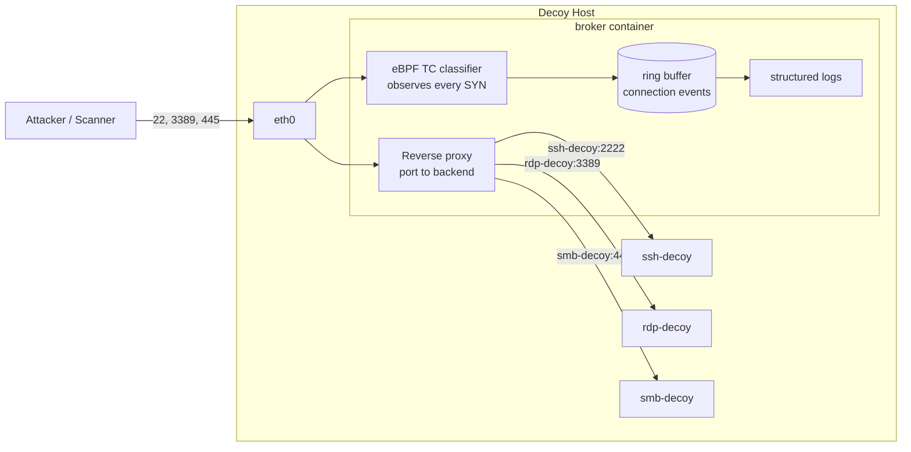

# cyber-decoy

A containerized network decoy (honeypot) that advertises **SSH**, **RDP**, and
**SMB**, observes every inbound connection with **eBPF**, and reverse-proxies
each session into an isolated decoy container.

The design separates two concerns:

1. **Observation.** An eBPF TC classifier attached to the broker's interface
   records every inbound TCP SYN, including scans against ports the decoy does
   not serve. This gives full visibility into probing activity.
2. **Interaction.** A userspace reverse proxy in the broker accepts connections
   on the advertised ports and opens a matching connection to the decoy
   container for that service, piping bytes in both directions and logging the
   full session.

> This is a defensive tool for detecting and studying unauthorized activity on
> networks you own or are authorized to monitor. Deploy it only where you have
> that authority.

## Architecture



Four containers in total:

| Container   | Role                                                        | Network        |
|-------------|-------------------------------------------------------------|----------------|
| `broker`    | Public front door: eBPF observation plus reverse proxy      | edge + decoynet |
| `ssh-decoy` | Fake SSH service                                            | decoynet only  |
| `rdp-decoy` | Fake RDP service                                            | decoynet only  |
| `smb-decoy` | Fake SMB service                                            | decoynet only  |

The decoys live on an `internal` Docker network (`decoynet`) with no route to
the host or the outside world. Only the broker can reach them. Nothing an
attacker does inside a decoy can reach the host network directly.

## How the eBPF routing works

The broker publishes ports 22, 3389, and 445 to the host, so inbound packets
arrive on the broker's `eth0`. Two things then happen to each packet:

- The **eBPF TC ingress program** (`broker/bpf/decoy.bpf.c`) parses the
  Ethernet, IP, and TCP headers, and for each new connection attempt (SYN set,
  ACK clear) writes a `conn_event` to a ring buffer: source IP and port,
  destination port, TCP flags, and whether the port is an advertised service.
  The packet is passed through unchanged (`TC_ACT_OK`).
- The **userspace proxy** accepts the connection on the matching listener and
  performs the equivalent of a `CONNECT` to the decoy backend for that service,
  then relays bytes both ways.

The `advertised_ports` eBPF map is populated at startup from `config.yaml`, so
the classifier can tag whether a probe hit a served port or an unsolicited one.
This makes horizontal port scans visible even though only three ports are
proxied.

If you want to advertise "everything is open" and funnel arbitrary destination
ports into the broker, extend the classifier to rewrite the destination port or
use a TPROXY / `bpf_sk_assign` redirect. The current version keeps the packet
path untouched and limits itself to observation, which is the safer default.

## Repository layout

```
cyber-decoy/
├── README.md
├── docker-compose.yml         # 4-container stack
├── docker-compose.override.yml # local macOS dev: no eBPF caps, port 22 remap
├── Makefile                   # build / up / down / bpf helpers
├── LICENSE
├── scripts/
│   └── setup.sh               # host preflight checks
├── broker/
│   ├── Dockerfile             # compiles eBPF object + Go binary
│   ├── config.yaml            # advertised services (configurable)
│   ├── go.mod
│   ├── main.go                # entrypoint
│   ├── bpf/
│   │   └── decoy.bpf.c        # eBPF TC classifier
│   └── internal/
│       ├── config/config.go   # config loader
│       ├── proxy/proxy.go     # TCP reverse proxy
│       └── bpf/loader.go      # loads + attaches eBPF, streams events
└── decoys/
    ├── common/responder.py    # shared placeholder decoy
    ├── ssh/Dockerfile
    ├── rdp/Dockerfile
    └── smb/Dockerfile
```

## Requirements

- Linux host with **kernel 6.6 or newer** for the TCX eBPF attach path. On older
  kernels the proxy still runs; only eBPF observation is skipped (the broker logs
  a warning and continues).
- Docker Engine with the Compose plugin (**v2.24+** if you use the bundled
  `docker-compose.override.yml`, which relies on the `!reset` / `!override` tags).
- A mounted BPF filesystem: `sudo mount -t bpf bpf /sys/fs/bpf`.

### Architecture

The broker image detects its build architecture and passes the matching
`__TARGET_ARCH_*` macro to clang, so it builds on both `x86_64` and `aarch64`
(Apple Silicon, Graviton). Note that `gcc-multilib` is deliberately **not**
installed: it is an x86-only package with no arm64 candidate, and including it
breaks the build on arm64 with apt exit code 100. Only `clang` and `libbpf-dev`
are needed to compile the eBPF object.

### Developing on macOS

Docker Desktop on macOS runs containers inside a LinuxKit VM rather than on your
host kernel, so TC/TCX eBPF attach generally will **not** work there. This is not
fatal: eBPF is best effort by design, so the broker logs `ebpf disabled: attach
failed` and the reverse proxy plus all three decoys run and log normally. You can
develop and test the entire proxy path locally, then get real eBPF observation
when you deploy to a Linux host.

`docker-compose.override.yml` is loaded automatically and makes this pleasant: it
drops the eBPF capabilities (useless in the VM) and remaps host port 22 to 2022,
since the Mac's own sshd owns 22.

```bash
docker compose up --build                    # local dev, override applied
docker compose -f docker-compose.yml up -d   # real deployment, override bypassed
```

Run the preflight check first:

```bash
./scripts/setup.sh
```

## Quick start

```bash
# 1. Build all four images (compiles the eBPF object inside the broker image)
make build

# 2. Start the stack
make up

# 3. Watch what happens
make logs
```

Then probe it from another machine (or localhost for a smoke test):

```bash
ssh -p 22 user@DECOY_HOST          # hits the SSH decoy
nc DECOY_HOST 3389                 # hits the RDP decoy
nc DECOY_HOST 445                  # hits the SMB decoy
nc DECOY_HOST 8080                 # unadvertised: observed by eBPF, no proxy
```

You will see structured JSON logs from the broker for both the eBPF probe events
and the proxied sessions, plus per-connection logs from each decoy container.

Tear down with:

```bash
make down
```

## Configuration

Services are defined in `broker/config.yaml`. Each entry is independently
toggleable and remappable:

```yaml
services:
  - name: ssh
    enabled: true
    listen_port: 22
    backend: ssh-decoy:2222
```

To add a service, add an entry here, publish the port in `docker-compose.yml`,
and add a decoy container. To disable one, set `enabled: false` (and optionally
drop its published port).

Note that host port 22 is usually taken by the host's real SSH daemon. For a lab
you can remap the published side in `docker-compose.yml`, for example
`"2022:22"`, and point your scanner there.

## The decoy backends

The included decoys (`decoys/common/responder.py`) are deliberately
**low-interaction placeholders**: they accept a connection, send an optional
banner, log the first bytes received, and close. They exist so the pipeline is
end to end from day one. Replace them with real emulators as needed:

| Service | Suggested higher-interaction replacement |
|---------|-------------------------------------------|
| SSH     | [Cowrie](https://github.com/cowrie/cowrie) |
| RDP     | [RDPy](https://github.com/citronneur/rdpy) |
| SMB     | [Dionaea](https://github.com/DinoTools/dionaea) or [Heralding](https://github.com/johnnykv/heralding) |

Because the broker only needs a `host:port` backend, swapping a decoy is just a
matter of changing the container and the `backend` value in `config.yaml`.

## Security notes

- **Capabilities.** The broker needs `NET_ADMIN` (and `BPF` / `PERFMON` on
  recent kernels) to load and attach the eBPF program. The Compose file requests
  these scoped capabilities. If your host or Docker version rejects them, the
  fallback is `privileged: true` on the broker service, which is broader and
  should be used only when scoped caps do not work.
- **Isolation.** Decoys sit on an `internal` network with no host route. Keep it
  that way. Treat every decoy container as potentially compromised.
- **Blast radius.** Run the whole stack on a host that is segmented from
  production. A decoy is bait; assume attackers will interact with it.
- **Legal.** Only monitor and deceive on infrastructure you own or are
  authorized to defend.

## Roadmap ideas

- Full-port funnel via eBPF destination rewrite or TPROXY.
- Session capture to PCAP per connection.
- Ship events to a SIEM (JSON logs are already structured for this).
- Rate limiting and connection quotas in the broker.

## License

MIT. See [LICENSE](LICENSE).
